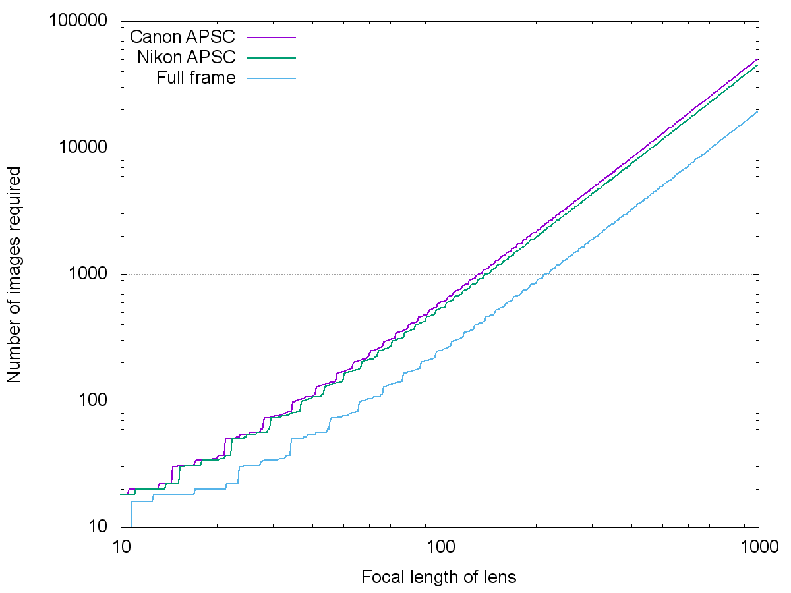

# full_sky_mosaic
Calculates the coordinates of images to cover a full sphere

This software calculates how many images are required to make a full sky mosaic, that covers the entire sphere.
It can also print out the right ascension and declination coordinates of the image centres that are required, and it can produce images illustrating the layout of the images.

## Usage
Download the MosaicFilled.java file, and compile it by running `javac MosaicFilled.java`. Then, the software can be executed by running:
```
java MosaicFilled width height overlap type
```
Width and height are the size of the image in degrees - width is the size in the RA direction, and height is the size in the Declination direction.
For a standard DSLR camera mounted on a German equatorial mount, width will usually be smaller than height.
Overlap is how much the images should overlap in degrees.
Type can be:
1. -cross - a cross-rectilinear projection pnm image will be written to the stdout.
2. -eq - an equirectangular projection pnm image will be written to the stdout.
3. -count - reports the number of images required.
4. -list - lists the coordinates of the image centres.

For example, if you run:
```
java MosaicFilled 100 65 0 -list
```
Then the following is written to the stderr:
```
Using 2 rings plus the polar images. Overlap between rings is 5.0
Ring 0 declination -30.0 count 4 overlap 0.34686544601399305
Ring 1 declination 30.0 count 4 overlap 0.34686544601399305
Total 10 images required
```
And then the following is written to the stdout:
```
0.0	-90.0	0h 0' 0"	-90° 0' 0"
0.0	-30.0	0h 0' 0"	-30° 0' 0"
90.0	-30.0	6h 0' 0"	-30° 0' 0"
180.0	-30.0	12h 0' 0"	-30° 0' 0"
270.0	-30.0	18h 0' 0"	-30° 0' 0"
0.0	30.0	0h 0' 0"	30° 0' 0"
90.0	30.0	6h 0' 0"	30° 0' 0"
180.0	30.0	12h 0' 0"	30° 0' 0"
270.0	30.0	18h 0' 0"	30° 0' 0"
0.0	90.0	0h 0' 0"	90° 0' 0"
```
Each line gives the coordinates of the centre of one image. The first two columns are the right ascension and declination in degrees, and the last two columns are the right ascension in hours, minutes, and seconds and declination in degrees, minutes, and seconds.
An image of this layout can be produced by running:
```
java MosaicFilled 100 65 0 -eq >image.pnm
```
which is shown below:


Note that 120 by 65 degree images are *extremely* wide angle - most camera lenses are not this wide. A more realistic run is for calculating the layout of images using a 50mm lens on a APSC-sized sensor (assuming a Canon APSC sensors, which is the smallest APSC size, 16.84° by 25.03°). The stderr for this (with overlap set to 2 degrees) is:
```
Using 8 rings plus the polar images. Overlap between rings is 3.9358587034554344
Ring 0 declination -73.13065111202015 count 13 overlap 4.190993876857778
Ring 1 declination -52.310833549069855 count 20 overlap 2.923576571958254
Ring 2 declination -31.462635868721307 count 24 overlap 2.3354730706994644
Ring 3 declination -10.531442048417734 count 25 overlap 2.09977933452304
Ring 4 declination 10.531442048417668 count 25 overlap 2.09977933452304
Ring 5 declination 31.46263586872124 count 24 overlap 2.3354730706994573
Ring 6 declination 52.310833549069784 count 20 overlap 2.923576571958236
Ring 7 declination 73.13065111202008 count 13 overlap 4.190993876857714
Total 166 images required
```
And this layout image is below:


The software can also generate the layout in a cube-rectilinear projection, as below:


The software correctly takes account of the fact the edge of a rectangle projected onto an equirectangular projection is curved, and therefore a ring of images doesn't necessarily cover a range of declination as large as the full height of the image.

The number of images required to cover a full sphere varies with the focal length of the lens and the size of the sensor. Here is a graph showing how many images are required for three DSLR sensor sizes, with an overlap of 10% of the longer size of the sub-frames:


